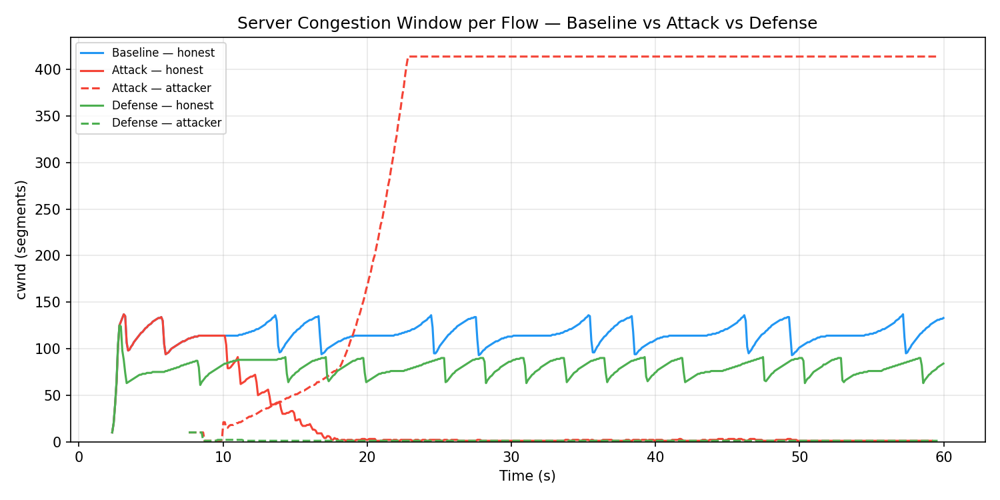
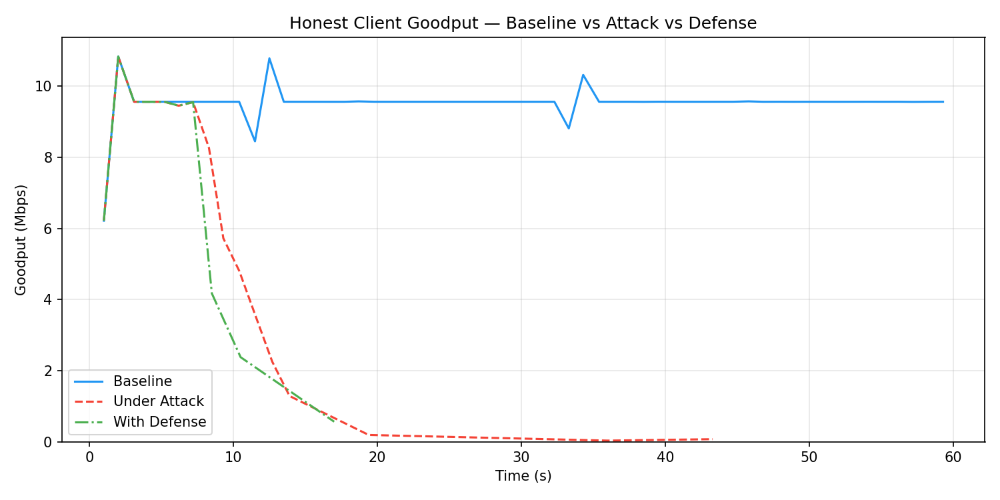

# TCP Optimistic-ACK Attack & Defense — Technical Writeup

**CSE 406: Computer Security Lab Project**

This document explains, mechanism by mechanism, **how the attack works** and
**how the defense works** in this testbed, and backs each claim with the
measured results. It is a companion to the code; every claim links to the file
and line that implements it.

---

## 1. Testbed & threat model

A Mininet **dumbbell** topology ([src/topology.py](src/topology.py)):

```
   h1 (NGINX server, 10.0.1.2)
    │  100 Mbps, unshaped
   r1 (Linux router — bottleneck shaper)
    │  tc tbf 10 Mbps  +  netem 50 ms one-way delay  +  shallow queue
   s1 (OVS switch, 100 Mbps access links)
   ╱ ╲
  h2   h3
 attacker    honest client
 10.0.0.3    10.0.0.2
```

| Element | Value | Set in |
|---|---|---|
| Bottleneck bandwidth (`B_path`) | 10 Mbps | [run_experiment.sh:26](scripts/run_experiment.sh) |
| One-way delay | 50 ms → **min RTT ≈ 100 ms** | [run_experiment.sh:25](scripts/run_experiment.sh) |
| Bandwidth–delay product (BDP) | ≈ 125 KB ≈ **85 MSS** | derived |
| Standing queue | ~50 pkts (drop-tail FIFO) | [topology.py:143-177](src/topology.py) |
| Server congestion control | CUBIC | [topology.py:189](src/topology.py) |
| Workload | 200 MB `video.mp4` over HTTP | [topology.py:206-215](src/topology.py) |

**Threat model.** The attacker (h2) is a *misbehaving receiver*. It opens a
legitimate TCP connection to the server and issues a real HTTP GET, but it lies
in its **ACKs** — acknowledging data it has not actually received. The goal is
not to crash the server; it is to trick the server's congestion control into
inflating the attacker's flow, which **overruns the shared bottleneck queue and
starves the honest client** (h3). This is the classic misbehaving-receiver
attack of Savage et al. (1999) and Sherwood et al. (2005), adapted to survive
modern Linux ACK validation.

Three scenarios are compared ([run_experiment.sh](scripts/run_experiment.sh)):

- **baseline** — honest client only.
- **attack** — honest client + optimistic-ACK attacker, no defense.
- **defense** — same attack, with the eBPF ACK filter (and a fair-queue
  backstop) enabled.

---

## 2. Part I — How the attack works

### 2.1 The principle: an ACK is a promise the sender trusts

TCP is **ACK-clocked**. The sender grows its congestion window (`cwnd`) as ACKs
arrive and estimates RTT from how quickly data is acknowledged. It *trusts* that
an ACK means the receiver actually got the data. An optimistic ACK breaks that
trust: by acknowledging bytes early, the receiver can

1. **hide loss** — if a packet was dropped at the bottleneck, an ACK that
   covers it anyway means the server never learns of the loss, so it never
   retransmits and never reduces `cwnd`; and
2. **compress RTT** — ACKing sooner than the data could physically have arrived
   shrinks the server's `srtt`, and CUBIC/Reno open the window faster at lower
   RTT.

The result is a congestion window decoupled from what the path can carry.

### 2.2 Why the naïve versions fail

The interesting engineering is that the *obvious* implementations self-destruct
or do nothing (documented in [optimistic_client.py:13-24](src/optimistic_client.py)):

- **Too aggressive** (advance the ACK pointer at a fixed rate): it quickly
  passes the server's real `snd_nxt`. The Linux kernel's `tcp_ack()` checks
  `if (after(ack, tp->snd_nxt))` and **drops** such an ACK
  (`SKB_DROP_REASON_TCP_ACK_UNSENT_DATA`). With no valid ACK advancing
  `snd_una`, the oldest unacked segment times out → RTO → `cwnd` collapses to 1.
  *The attack destroys itself.*
- **Too timid** (only ACK data actually received): under an inflated window the
  bottleneck drops the tail of every burst; those bytes never arrive, the ACK
  stalls, the server sees the loss and backs off. *No theft — just a fair-share
  flow.*

A working attacker must stay in the narrow band **`received < ack ≤ snd_nxt`**:
always ahead of what it received (to steal), but never past what the server
sent (to avoid the kernel drop).

### 2.3 The sustainable design: a *delivery-clocked* ACK

The core rule ([optimistic_client.py:377-384](src/optimistic_client.py)):

```
ack = rcv_high + margin,   where   margin = f · rate_est · RTT0
```

- **`rcv_high`** — the highest byte the attacker's background sniffer has
  actually seen leave the server ([optimistic_client.py:221-253](src/optimistic_client.py)).
  Because it is a *cumulative high-water mark*, ACKing it **already covers bytes
  the bottleneck dropped** — this is the loss-concealment weapon, for free.
- **`rate_est`** — a time-aware EWMA of the server's *measured* delivery rate.
  Anchoring the ACK advance to the real delivery rate means the long-run
  ACK-advance rate equals the true send rate and **can never run away** past
  `snd_nxt`.
- **`margin`** — a small, bounded lead *ahead* of `rcv_high`, i.e. the
  optimistic part. `RTT0` is the base RTT measured during the handshake, before
  any queue builds.

So the ACK rides on real delivery (safe) plus a controlled optimistic lead
(the theft). The lead is what compresses RTT and keeps the window inflating.

### 2.4 Keeping it alive: AIMD control + a liveness invariant

The lead fraction **`f`** is controlled by AIMD
([optimistic_client.py:351-407](src/optimistic_client.py)):

- **Additive increase**: once per RTT, `f += 0.05` (probe up while data flows).
- **Multiplicative decrease + margin collapse**: the *only* observable symptom
  of an accidental overshoot past `snd_nxt` is that the server stops advancing
  `snd_una` and therefore **stops sending** — detected as a delivery stall
  (`no data for STALL_GAP`, or delivery rate falling below half its peak,
  [optimistic_client.py:367](src/optimistic_client.py)). On a stall, `f` is
  halved **and `margin` drops to 0**, so the next ACK is exactly `rcv_high` —
  valid with certainty — which re-opens the window well within the RTO. This is
  the **liveness invariant** that keeps the connection from ever timing out.

A hard clamp (`margin ≤ 0.75 × BDP`, [optimistic_client.py:379-383](src/optimistic_client.py))
guarantees the lead never reaches the real `snd_nxt` even if `f` and `rate_est`
both spike.

### 2.5 Supporting mechanics

- **No TCP timestamps** in the handshake ([optimistic_client.py:156-166](src/optimistic_client.py)):
  without the timestamp option, the server measures RTT from each segment's send
  time, so the early ACKs *directly* shrink `srtt`. Negotiating timestamps would
  let the server derive RTT from the echoed `TSval` and blunt the
  RTT-compression half of the attack.
- **Kernel RST suppression**: the attacker speaks TCP from user space (Scapy),
  so the host kernel would send a RST for the "unknown" connection. An iptables
  rule drops outbound RSTs ([topology.py:196-201](src/topology.py)).
- **High advertised window** (`400 · MSS`) so the *receiver* window never
  becomes the limiting factor — only `cwnd` governs
  ([optimistic_client.py:299-303](src/optimistic_client.py)).

### 2.6 Attack results





Under attack (red):

- The **attacker's `cwnd` inflates to ~414 segments** (≈ 5× the 85-MSS BDP) and
  stays pinned there — its optimistic ACKs conceal every bottleneck drop, so
  CUBIC never backs off.
- The **honest client's `cwnd` collapses to ~1** and its **goodput falls from
  ~9.5 Mbps to essentially 0 within ~15 s** of the attack starting. The honest
  download effectively stalls (only 16 of 60 goodput samples are non-zero).
- The bottleneck queue is overrun: **cumulative drops jump from 39 (baseline)
  to 103,964** — the collateral damage of the attacker's oversized window
  flooding a shared drop-tail FIFO.

| Metric | Baseline | Attack |
|---|---:|---:|
| Honest goodput (avg of live samples) | 9.53 Mbps | 5.68 Mbps* |
| Honest goodput, steady state | ~9.5 Mbps | **~0 Mbps** |
| Honest `cwnd` (avg) | 115 | 22 |
| Attacker `cwnd` (max) | — | **414** |
| Bottleneck drops (cumulative) | 39 | **103,964** |

\* The attack average is taken over only the first ~16 s before the honest flow
collapses, so it *overstates* what the honest client actually receives; the
steady-state row and the goodput plot show the real picture.

---

## 3. Part II — How the defense works

### 3.1 Where it sits

The defense is a pair of **eBPF programs on the server** that inspect packets in
the datapath, *before* the kernel's TCP stack processes them
([defense/defense_inspector.c](defense/defense_inspector.c),
loaded by [defense/defense_loader.py](defense/defense_loader.py)). Fabricated
ACKs are dropped at the NIC ingress, so they can never inflate `cwnd` in the
first place. The two programs share one pinned `flow_table` map:

- **`tc_snd_tracker`** — TC **egress** hook. Watches the server's *outgoing*
  data and records, per flow, the true `snd_max` (highest sequence actually put
  on the wire) directly in the datapath
  ([defense_inspector.c:158-235](defense/defense_inspector.c)). This replaces
  the previous, broken approach of pushing `snd_max` in from user space by
  parsing `ss` — which silently no-op'd and left the whole defense inert
  ([defense_loader.py:12-17](defense/defense_loader.py)).
- **`xdp_ack_filter`** — XDP **ingress** hook. Inspects every incoming client
  ACK and enforces three invariants
  ([defense_inspector.c:240-364](defense/defense_inspector.c)).

### 3.2 The three checks on each incoming ACK

**Check 1 — Sent-bound: `ack ≤ snd_max`**
([defense_inspector.c:300-308](defense/defense_inspector.c)).
A receiver cannot acknowledge data the server never sent. Catches the *naïve
aggressive* attacker directly. (Fails open if `snd_max` is still 0, so the
handshake is never dropped.)

**Check 2 — Time-bound: `ack ≤ snd_max(now − RTT_MIN)`** — *the key check*
([defense_inspector.c:310-334](defense/defense_inspector.c)).
The physical RTT floor is ~100 ms (50 ms out + 50 ms back), so an honest
receiver **cannot** ACK a byte sooner than ~100 ms after the server sent it. The
egress tracker keeps a ring of `snd_max` snapshots every 5 ms
([defense_inspector.c:226-233](defense/defense_inspector.c)); the filter
reconstructs "what `snd_max` was one min-RTT ago" (`RTT_MIN = 90 ms`, set just
under the physical floor so a legitimate ACK is *never* dropped) and rejects any
ACK that exceeds it.

This is precisely the check that stops the **delivery-clocked** attacker of
§2.3. That attacker deliberately stays under `snd_max` (evading Check 1) and
paces its advance at ~`B_path` (evading Check 3) — but its whole *point* is to
ACK the `margin` of data that was put on the wire **within the last RTT**. The
time-bound check measures exactly that illegal lead and drops it.

**Check 3 — Rate-bound: ACK-advance rate ≤ `B_path + 25%`**
([defense_inspector.c:336-363](defense/defense_inspector.c)).
A per-flow **token bucket** (refilled at `RATE_LIMIT_BPS`, burst `128 KB`).
A flow behind a 10 Mbps bottleneck physically cannot *receive* faster than
10 Mbps, so it must not be allowed to *ACK* faster than that. Because advance is
measured from the last ACK **the filter accepted**, dropping an over-rate ACK
genuinely holds `snd_una` back — the attacker's ACK number can climb no faster
than tokens refill.

Together: Check 1 stops crude forgery, Check 3 caps sustained ACK velocity, and
Check 2 closes the gap a rate-limited, sent-bounded — but still *optimistic* —
attacker would otherwise slip through.

### 3.3 Defense-in-depth (secondary layers)

The `defense` scenario also enables two backstops:

- **Per-flow fair queue (`fq_codel`) at the bottleneck**
  ([topology.py:151-166](src/topology.py), `--fair`). Even if optimistic ACKs
  *did* inflate the attacker's window, fq_codel isolates each flow to its own
  sub-queue and drops the attacker's overflow *there*, so it can no longer crowd
  the honest flow out of a shared FIFO.
- **NGINX `limit_rate`** (application-layer, **disabled by default**,
  [config/nginx.conf:32-49](config/nginx.conf)). Paces how fast NGINX feeds the
  socket, decoupling an inflated `cwnd` from the actual send rate.

**Which layer actually did the work here?** By design, fq_codel is the *robust*
primary — it neutralises the attack even against variants the server-side filter
cannot see (see *Limitations*, §4) — and the ACK filter is a complementary layer whose time-bound
check makes a server-side defense viable at all. In *these* runs, though, the ACK
filter is clearly the binding constraint: the attacker's `cwnd` is capped at
**10** (initial window), and fq_codel *cannot* produce that. fq_codel does not
stop window growth — it only isolates the queue — so under fq_codel alone the
attacker's window would still inflate and its flow would settle to a fair-share
`cwnd` (~80, like the honest flow), not stall at 10. A window frozen at the
initial value means the optimistic ACKs are being **dropped before the TCP stack
sees them**, i.e. the XDP filter is doing it. A clean ablation (each layer alone)
would be needed to fully partition the credit; the `cwnd = 10` signature is the
evidence that the filter is active and effective. This also nuances the cautious
comment in [topology.py:156-159](src/topology.py) that "a server-side ACK filter
cannot" neutralise the attack — true for the sent-bound and rate-bound checks
*alone*, but the time-bound check narrows the gap substantially.

### 3.4 Defense results

In the `defense` run (green in the plots above):

- The **attacker's `cwnd` never inflates** — it is capped at **10 segments**
  (avg 1). Its optimistic ACKs are dropped, so `snd_una` does not advance and
  CUBIC never opens the window.
- The **honest client is protected**: its `cwnd` holds a healthy CUBIC sawtooth
  (~80 avg) and its **goodput stays at ~8.9 Mbps for the full 60 s** — within
  ~7% of the 9.53 Mbps baseline, versus ~0 under attack.
- The bottleneck is calm again: **cumulative drops fall from 103,964 (attack)
  back to 19** — essentially the baseline's 39. No queue overrun because the
  oversized window that caused it never forms.

| Metric | Baseline | Attack | **Defense** |
|---|---:|---:|---:|
| Honest goodput (steady state) | ~9.5 Mbps | ~0 Mbps | **~8.9 Mbps** |
| Honest goodput (avg, full run) | 9.53 Mbps | 5.68 Mbps\* | **8.87 Mbps** |
| Live goodput samples (of 60) | 57 | 16 | **57** |
| Honest `cwnd` (avg) | 115 | 22 | **80** |
| Attacker `cwnd` (max) | — | 414 | **10** |
| Bottleneck drops (cumulative) | 39 | 103,964 | **19** |

\* See the note in §2.6 — the attack average is inflated by counting only the
pre-collapse window.

**Bottom line:** the defense restores the honest client from ~0 to ~8.9 Mbps and
neutralises the attacker's window (414 → 10 segments), returning the bottleneck
to baseline drop levels.

---

## 4. Key takeaways

1. **The attack's power is loss concealment, not brute force.** Anchoring the
   ACK to a cumulative delivery high-water mark hides every bottleneck drop; the
   optimistic *margin* on top adds RTT compression. Anchoring to the *measured*
   delivery rate is what keeps it from self-destructing.
2. **Modern Linux already blocks the crude attack** (`ack > snd_nxt` is
   dropped), which is why a *bounded, delivery-clocked, AIMD-controlled*
   attacker is needed to succeed at all.
3. **A sent-bound/rate-bound ACK filter is not enough** against such an
   attacker — it stays under both bounds by construction. The **time-bound
   (min-RTT) check** is the piece that catches it, because the one thing the
   attacker *cannot* fake is having received data faster than the speed of the
   path.
4. **Defense-in-depth matters.** fq_codel and `limit_rate` would each contain
   the *damage* even if the filter were bypassed; the ACK filter prevents the
   *cause*.

### Limitations

- **Residual loss-concealment cannot be caught server-side.** The time-bound
  check stops the *RTT-compression* half of the attack (ACKing data sent < min-RTT
  ago). But an attacker that ACKs only `rcv_high` — data it genuinely received,
  which *is* legitimately older than one min-RTT — still conceals any packets the
  **router** dropped downstream of the server, because the server has no way to
  know which of the bytes it put on the wire actually arrived. Fully closing this
  needs *delivery ground-truth the server doesn't have*: router-side accounting,
  or a cryptographic scheme like ACK **nonces**/SACK that forces the receiver to
  prove receipt. This is exactly why **fq_codel is kept as the robust primary
  layer** — it defends by *isolation* (the attacker can only hurt its own
  sub-queue) and so does not depend on detecting the lie at all.
- **Parameters are tuned to this path.** `RTT_MIN = 90 ms` and
  `RATE_LIMIT_BPS = 10 Mbps + 25%` are set for the 50 ms / 10 Mbps testbed
  ([defense_inspector.c:61-79](defense/defense_inspector.c)). On a different path
  they must be re-derived, and a network with real RTT variance below the floor
  would need a safety margin re-think.
- **Single bottleneck, single attacker.** The evaluation is one dumbbell with one
  attacker and one honest flow; multi-flow fairness and multiple simultaneous
  attackers are out of scope here.

## 5. Reproducing these results

```bash
sudo ./scripts/run_experiment.sh all
python3 scripts/plot_results.py --results /tmp/cse406/results \
    --output /tmp/cse406/results/plots
```

Results land in `/tmp/cse406/results/<scenario>_cubic/` (one CSV row per flow
per sample, tagged `honest`/`attacker`); plots land in `.../plots/`. The
copies committed under [results/](results/) are the dataset this writeup
analyses.

---

*See also [Design_Report_(2105158,2105160).pdf](Design_Report_(2105158,2105160).pdf)
for the formal report.*
